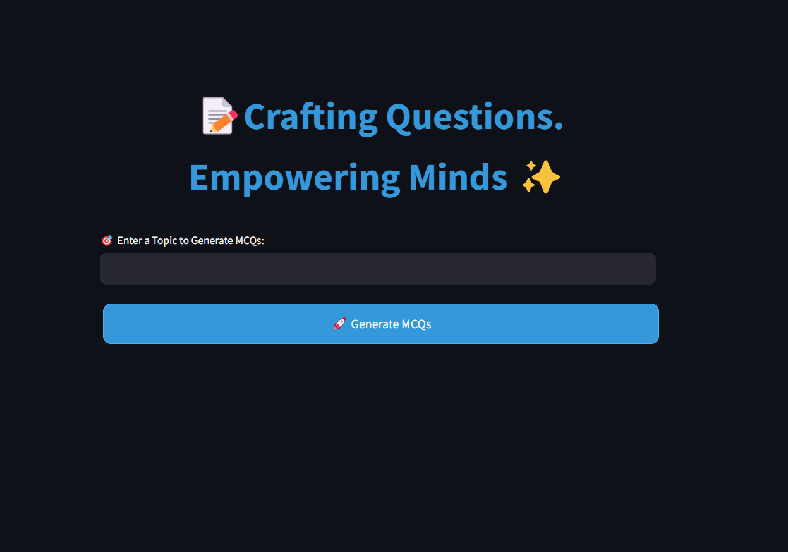
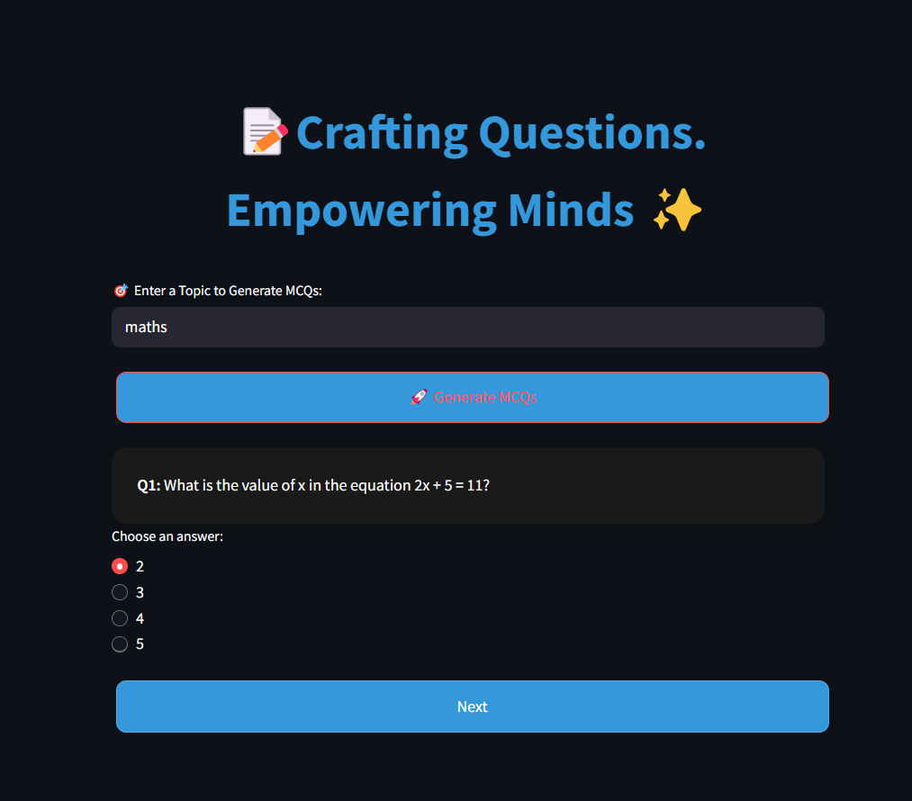

# 🧠 QuizCrafter AI

**Crafting Questions. Empowering Minds ✨**

**QuizCrafter AI** is a Streamlit-based web application that generates high-quality **multiple-choice questions (MCQs)** from any topic you input.  
Powered by **LangChain**, **Groq’s LLaMA 3 (70B)** model, and an intuitive Streamlit UI, this app is perfect for students, teachers, and educational content creators.

---

## 🚀 Features

- 🎯 Enter any topic to generate relevant MCQs
- 📝 Each question has 4 options (A, B, C, D) with exactly one correct answer
- 🧠 Memory support via LangChain’s `ConversationBufferMemory`
- 🖼️ Beautiful, dark-mode friendly UI using Streamlit custom styling
- ✅ Score tracker and feedback after test
- 🔁 Restart quiz anytime

---

## 📦 Tech Stack

| Tool/Framework      | Role                              |
|---------------------|-----------------------------------|
| **Python**          | Core programming language         |
| **Streamlit**       | Frontend UI and interaction       |
| **LangChain**       | LLM orchestration and memory      |
| **Groq API**        | Backend LLM provider (LLaMA 3)    |

---

## 🛠️ Installation

### 1. Clone the repository

```bash
git clone https://github.com/your-username/quizcrafter-ai.git
cd quizcrafter-ai

## 🖼️ Demo




